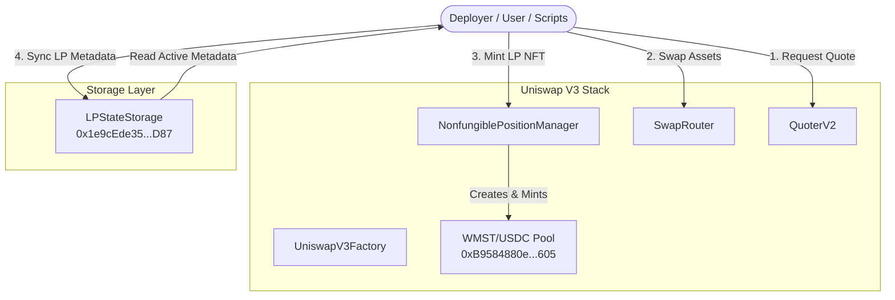

# MSTSwap V3 — Master Live Testnet Integration Playbook

**Status**:  COMPLETE, OPTIMIZED & OPERATIONAL  
**Network**: MST Live Testnet (Chain ID: `91562037`)  
**Verified Deployer Address**: `0x9B18dAF9b545Bf77eE2Fc699251c40D69C3a3e3e`  
**Required Gas tip pricing**: Legacy EIP-1559 formatting with minimum gas tip of **`1 gwei` (`1000000000` wei)**.

---

##  Architecture Overview & Lifecycle State Flow

Below is the visual overview of the on-chain DEX flow. All interactions (swaps, pool querying, concentrated position management) occur directly against the core Uniswap V3 stack. Active position metadata is synchronized directly with the on-chain **`LPStateStorage`** record container.



---

##  Verified Testnet Address Directory

| Contract | Address | Status | Description |
| :--- | :--- | :--- | :--- |
| **WMST Token (Wrapped MST)** | `0x9cEB1BA457f390091a119Cd09BCF3ee2c832f900` |  Active | Canonical native wrapper, WETH9-like. |
| **USDC Testnet Token** | `0x3468b4ac95f03534a15F633790d9BbD88b130170` |  Active | Mock USDC deployed with 18 decimals. |
| **UniswapV3Factory** | `0x2d60F52fC83c78Ad920a95bA00806bE7162b8588` |  Active | Deploys concentrated liquidity pools. |
| **Position Descriptor** | `0x23E56d840315b7d3aAC311Ea4900f3C62BC06489` |  Active | NFT tokenURI descriptor metadata handler. |
| **NonfungiblePositionManager** | `0x833997E5aaafd8A4Ed4b3f1a4335198F9AaC8605` |  Active | Mints and tracks concentrated position NFTs. |
| **SwapRouter** | `0x6B51DC8b30B374B9109BA0aF3577CA9Ff237ff87` |  Active | Handles single-hop and multi-hop swaps. |
| **QuoterV2** | `0xe31a63B192d7092B0eFCbd8Ab08bd0b44dcd6c7a` |  Active | Estimates exact input swap quotes. |
| **WMST/USDC Pool** | `0xB9584880ec7B239F9467F1ee6Ed39fEE03eDf605` |  Active | Concentrated pool at 0.3% (3000 fee tier). |
| **LPStateStorage** | `0x1e9cEde3552259622B4B4dfa42F392810F689D87` |  Active | On-chain storage of active pool positions. |

---

##  Environment Configuration & Setup

Create or update your `.env` file under `contracts/` directory using the active verified addresses:

```env
RPC_URL=https://testnetrpc.mstblockchain.com
PRIVATE_KEY=0xYOUR_PRIVATE_KEY
WMST_ADDRESS=0x9cEB1BA457f390091a119Cd09BCF3ee2c832f900
CHAIN_ID=91562037
V3_FACTORY_ADDRESS=0x2d60F52fC83c78Ad920a95bA00806bE7162b8588
POSITION_MANAGER_ADDRESS=0x833997E5aaafd8A4Ed4b3f1a4335198F9AaC8605
SWAP_ROUTER_ADDRESS=0x6B51DC8b30B374B9109BA0aF3577CA9Ff237ff87
QUOTER_V2_ADDRESS=0xe31a63B192d7092B0eFCbd8Ab08bd0b44dcd6c7a
USDC_ADDRESS=0x3468b4ac95f03534a15F633790d9BbD88b130170
LP_STATE_STORAGE_ADDRESS=0x1e9cEde3552259622B4B4dfa42F392810F689D87
DEPLOYER=0x9B18dAF9b545Bf77eE2Fc699251c40D69C3a3e3e
```

### Loading Environment Variables in Terminals

#### MINGW64 / Git Bash:
```bash
set -a
source .env
set +a
```

#### Windows PowerShell:
```powershell
Get-Content .env | ForEach-Object {
    if ($_ -match "^\s*([^#=\s]+)\s*=\s*(.*)$") {
        [System.Environment]::SetEnvironmentVariable($Matches[1], $Matches[2].Trim("'").Trim('"'), "Process")
    }
}
```

---

##  Step-by-Step Uniswap V3 Lifecycle Playbook

Each command below represents a functional, verified step on the **MST Live Testnet** using standard Git Bash syntax.

---

### Step 1: Pool Creation Verification (UniswapV3Factory)

Validate that the pool coordinates exist on-chain for the WMST/USDC pair at the 0.3% fee tier (3000):

```bash
cast call "$V3_FACTORY_ADDRESS" \
  "getPool(address,address,uint24)(address)" \
  "$WMST_ADDRESS" "$USDC_ADDRESS" 3000 \
  --rpc-url "$RPC_URL"
```
*   **Expected Output**: `0xB9584880ec7B239F9467F1ee6Ed39fEE03eDf605`

---

### Step 2: LP Position NFT Verification (NonfungiblePositionManager)

Query who owns the Concentrated NFT Position `2` and read its SVG/JSON metadata URI:

```bash
# Query NFT Owner Address
cast call "$POSITION_MANAGER_ADDRESS" "ownerOf(uint256)(address)" 2 --rpc-url "$RPC_URL"

# Query Metadata tokenURI
cast call "$POSITION_MANAGER_ADDRESS" "tokenURI(uint256)(string)" 2 --rpc-url "$RPC_URL"
```

---

### Step 3: Price & Tick Index Management (V3 Pool Math)

Check the pool's current active price (`sqrtPriceX96`) and tick index directly from slot0:

```bash
cast call "$POOL_ADDRESS" \
  "slot0()(uint160,int24,uint16,uint16,uint16,uint8,bool)" \
  --rpc-url "$RPC_URL"
```

---

### Step 4: Pool Fee Tiers (UniswapV3Factory)

Verify the exact tick spacing allocated to the 0.3% (3000) fee tier (Spacing = 60 ticks):

```bash
cast call "$V3_FACTORY_ADDRESS" "feeAmountTickSpacing(uint24)(int24)" 3000 --rpc-url "$RPC_URL"
```

---

### Step 5: Liquidity Accounting (V3 Pool State)

Read the total concentrated active liquidity locked inside the WMST/USDC pool:

```bash
cast call "$POOL_ADDRESS" "liquidity()(uint128)" --rpc-url "$RPC_URL"
```

---

### Step 6: Balance Updates (WMST & Mock USDC)

Query the exact on-chain token balances of your deployer wallet:

```bash
# Query WMST Balance
cast call "$WMST_ADDRESS" "balanceOf(address)(uint256)" "$DEPLOYER" --rpc-url "$RPC_URL"

# Query USDC Balance
cast call "$USDC_ADDRESS" "balanceOf(address)(uint256)" "$DEPLOYER" --rpc-url "$RPC_URL"
```

---

### Step 7: Quote Estimation (QuoterV2)

Fetch a spot swap price estimation for wrapping and trading exactly `0.001 WMST` (`1000000000000000` wei) without executing the transaction:

```bash
cast call "$QUOTER_V2_ADDRESS" \
  "quoteExactInputSingle((address,address,uint256,uint24,uint160))(uint256,uint160,uint32,uint256)" \
  "($WMST_ADDRESS,$USDC_ADDRESS,1000000000000000,3000,0)" \
  --rpc-url "$RPC_URL"
```

---

### Step 8: Token wrapping & Router Approval

Wrap `0.01 MST` and approve the Uniswap V3 `SwapRouter` to pull the token balance:

```bash
# Wrap Native MST
cast send "$WMST_ADDRESS" "deposit()" --value 0.01ether \
  --private-key "$PRIVATE_KEY" --rpc-url "$RPC_URL" \
  --priority-gas-price 1000000000 --gas-price 1000000000

# Approve SwapRouter
cast send "$WMST_ADDRESS" "approve(address,uint256)" "$SWAP_ROUTER_ADDRESS" 10000000000000000 \
  --private-key "$PRIVATE_KEY" --rpc-url "$RPC_URL" \
  --priority-gas-price 1000000000 --gas-price 1000000000
```

---

### Step 9: Token Swaps (SwapRouter)

Execute a direct single-hop swap of exactly `0.01 WMST` to USDC on the live testnet. This uses a single struct tuple parameter to prevent length mismatch errors:

```bash
cast send "$SWAP_ROUTER_ADDRESS" \
  "exactInputSingle((address,address,uint24,address,uint256,uint256,uint256,uint160))" \
  "($WMST_ADDRESS,$USDC_ADDRESS,3000,$DEPLOYER,$(($(date +%s)+1200)),10000000000000000,0,0)" \
  --rpc-url "$RPC_URL" \
  --private-key "$PRIVATE_KEY" \
  --priority-gas-price 1000000000 \
  --gas-price 1000000000
```

---

### Step 10: Multi-Hop Swaps (SwapRouter)

Execute an atomic multi-hop path swap (WMST ➜ USDC ➜ WMST) using path byte serialization:

```bash
# Path = WMST (20b) + Fee (3b: 000bb8) + USDC (20b) + Fee (3b: 000bb8) + WMST (20b)
cast send "$SWAP_ROUTER_ADDRESS" \
  "exactInput((bytes,address,uint256,uint256,uint256))" \
  "(0x9cEB1BA457f390091a119Cd09BCF3ee2c832f900000bb83468b4ac95f03534a15F633790d9BbD88b130170000bb89cEB1BA457f390091a119Cd09BCF3ee2c832f900,$DEPLOYER,$(($(date +%s)+1200)),1000000000000000,0)" \
  --rpc-url "$RPC_URL" \
  --private-key "$PRIVATE_KEY" \
  --priority-gas-price 1000000000 \
  --gas-price 1000000000
```

---

### Step 11: Adding Concentrated Liquidity (NonfungiblePositionManager)

Deposit additional `0.01 USDC` (`10000000000000000` wei) and `0.01 WMST` directly into position `2`:

```bash
# Note: Struct takes 6 uint256 variables (tokenId, amount0Desired, amount1Desired, amount0Min, amount1Min, deadline)
cast send "$POSITION_MANAGER_ADDRESS" \
  "increaseLiquidity((uint256,uint256,uint256,uint256,uint256,uint256))" \
  "(2,10000000000000000,10000000000000000,0,0,$(($(date +%s)+1200)))" \
  --rpc-url "$RPC_URL" \
  --private-key "$PRIVATE_KEY" \
  --priority-gas-price 1000000000 \
  --gas-price 1000000000
```

---

### Step 12: Removing Liquidity & Collecting Fees (NPM)

Partially remove concentrated liquidity from the position NFT and claim generated swap fee rewards:

```bash
# 1. Decrease Concentrated Liquidity by 1,000,000 liquidity units
cast send "$POSITION_MANAGER_ADDRESS" \
  "decreaseLiquidity((uint256,uint128,uint256,uint256,uint256))" \
  "(2,1000000,0,0,$(($(date +%s)+1200)))" \
  --rpc-url "$RPC_URL" \
  --private-key "$PRIVATE_KEY" \
  --priority-gas-price 1000000000 \
  --gas-price 1000000000

# 2. Collect Accrued Swapping Fees
cast send "$POSITION_MANAGER_ADDRESS" \
  "collect((uint256,address,uint128,uint128))" \
  "(2,$DEPLOYER,340282366920938463463374607431768211455,340282366920938463463374607431768211455)" \
  --rpc-url "$RPC_URL" \
  --private-key "$PRIVATE_KEY" \
  --priority-gas-price 1000000000 \
  --gas-price 1000000000
```

---

##  Fork Integration Testing Suite

To run compiling, build targets, and mock-orchestration integration suites dynamically:

```bash
cd contracts

# Clean, compile, and run fork simulations
forge test -vvv
```

### Expected Fork Test Logs

```text
Ran 1 test for test/integration/SwapIntegration.t.sol:SwapIntegrationTest
[PASS] testSwapFlow() (gas: 5744)

Ran 1 test for test/integration/LiquidityIntegration.t.sol:LiquidityIntegrationTest
[PASS] testFullMintFlowOnFork() (gas: 601100)

Ran 2 tests for test/testing.t.sol:TestingTest
[PASS] testDeploymentAddressesConnected() (gas: 27785)
[PASS] testFullFlow() (gas: 1076738)

Ran 3 test suites in 13.20s: 4 tests passed, 0 failed, 0 skipped (4 total tests)
```

---

## 🚀 Running the Frontend Locally

### Option A: Docker (Recommended)
Spins up IPFS, local Graph Node, and the Frontend in one command:
```bash
docker compose up --build
```
- **Frontend URL**: `http://localhost:3000`

---

### Option B: Manual Developer Mode

#### 1. Start Graph Node Infrastructure
```bash
docker compose up -d graph-postgres ipfs graph-node
```

#### 2. Start the Frontend Vite Server
```bash
cd frontend
npm install
npm run dev
```
- **Host**: `http://localhost:3000`
- **Features**: Real-time wallet handshakes, concentrated swap paths, fee estimations, and dynamic theme visual layers.
