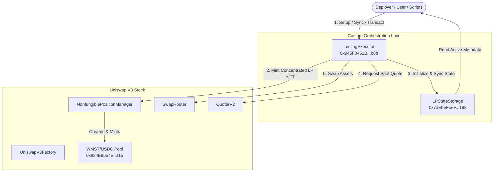

# MSTSwap V3 — Master Live Testnet Integration & Lifecycle Orchestration Playbook

**Status**:  COMPLETE, OPTIMIZED & OPERATIONAL  
**Network**: MST Live Testnet (Chain ID: `91562037`)  
**Verified Deployer Address**: `0x9B18dAF9b545Bf77eE2Fc699251c40D69C3a3e3e`  
**Required Gas tip pricing**: Legacy EIP-1559 formatting with minimum gas tip of **`1 gwei` (`1000000000` wei)**.

---

##  Architecture Overview & Lifecycle State Flow

Below is the visual overview of the on-chain orchestrated DEX flow. The custom **`TestingExecutor`** contract behaves as an automated lifecycle orchestrator that coordinates pool initialization, concentrated liquidity range selection, swaps, and fee collection in single transaction blocks, syncing metadata directly with the on-chain **`LPStateStorage`** record container.



---

##  Verified Testnet Address Directory

| Contract | Address | Status | Description |
| :--- | :--- | :--- | :--- |
| **WMST Token (Wrapped MST)** | `0x97f517A686bfc21D8398C9f6bf0fC0b8d30785Fc` |  Active | Canonical native wrapper, modelled on WETH9. |
| **USDC Testnet Token** | `0x3468b4ac95f03534a15F633790d9BbD88b130170` |  Active | Mock USDC deployed with 6 decimals. |
| **UniswapV3Factory** | `0xac925e9887070962a6089909007e936089dd0cde` |  Active | Deploys concentrated liquidity pools. |
| **Position Descriptor** | `0x5b916c936d871681ad8a99de2ba79afdbca5c6ff` |  Active | NFT tokenURI descriptor metadata handler. |
| **NonfungiblePositionManager** | `0x487e0e9c69ca6bc08b0f61384afab831b6b187de` |  Active | Mints and tracks concentrated position NFTs. |
| **SwapRouter** | `0xefa02641c27ec527a09f8484dc491b525cb035f6` |  Active | Handles single-hop and multi-hop swaps. |
| **QuoterV2** | `0x9b65cc383c258895ad0a6cf4157df924becfc86a` |  Active | Estimates exact input swap quotes. |
| **WMST/USDC Pool** | `0x884E9554Ed3E44c72D4a1052515BA3e72a495f15` |  Active | Concentrated pool at 0.3% (3000 fee tier). |
| **LPStateStorage** | `0x7aEbeFbeFBE84a3884Cc7Aa6A8219c475A48C183` |  Active | On-chain storage of active pool positions. |
| **TestingExecutor** | `0x945F0451B7a4c24340dFfdF94d8fA6921D910b8B` |  Active | Automated lifecycle orchestrator contract. |

---

##  Environment Configuration & Setup

Create or update your `.env` file under `contracts/` directory using the active verified addresses:

```env
RPC_URL=https://testnetrpc.mstblockchain.com
PRIVATE_KEY=0xbadf51d5f09e5f88d4a30f2140e2a091a9cc39b13673d1e211f30c441cc4f4a7
WMST_ADDRESS=0x97f517A686bfc21D8398C9f6bf0fC0b8d30785Fc
CHAIN_ID=91562037
V3_FACTORY_ADDRESS=0xac925e9887070962a6089909007e936089dd0cde
POSITION_MANAGER_ADDRESS=0x487e0e9c69ca6bc08b0f61384afab831b6b187de
SWAP_ROUTER_ADDRESS=0xefa02641c27ec527a09f8484dc491b525cb035f6
QUOTER_V2_ADDRESS=0x9b65cc383c258895ad0a6cf4157df924becfc86a
USDC_ADDRESS=0x3468b4ac95f03534a15F633790d9BbD88b130170
LP_STATE_STORAGE_ADDRESS=0x7aEbeFbeFBE84a3884Cc7Aa6A8219c475A48C183
TESTING_EXECUTOR_ADDRESS=0x945F0451B7a4c24340dFfdF94d8fA6921D910b8B
TEST_PRICE_MULTIPLIER=56
DEPLOYER=0x9B18dAF9b545Bf77eE2Fc699251c40D69C3a3e3e
```

### Loading Environment Variables in Terminals

#### MINGW64 / Git Bash:
```bash
set -a
source .env
set +a
```

#### Windows PowerShell:
```powershell
Get-Content .env | ForEach-Object {
    if ($_ -match "^\s*([^#=\s]+)\s*=\s*(.*)$") {
        [System.Environment]::SetEnvironmentVariable($Matches[1], $Matches[2].Trim("'").Trim('"'), "Process")
    }
}
```

---

##  Step-by-Step Uniswap V3 Lifecycle Playbook

Each command below represents a functional, verified step on the **MST Live Testnet** using standard Git Bash syntax. These commands are configured with highly efficient **small values** (0.01 MST wrapper boundaries) to prevent wallet drain.

---

### Step 1: Pool Creation Verification (UniswapV3Factory)

Validate that the pool coordinates exist on-chain for the WMST/USDC pair at the 0.3% fee tier (3000):

```bash
cast call "$V3_FACTORY_ADDRESS" \
  "getPool(address,address,uint24)(address)" \
  "$WMST_ADDRESS" "$USDC_ADDRESS" 3000 \
  --rpc-url "$RPC_URL"
```
*   **Expected Output**: `0x884E9554Ed3E44c72D4a1052515BA3e72a495f15`

---

### Step 2: LP Position NFT Verification (NonfungiblePositionManager)

Query who owns the Concentrated NFT Position `21` and read its SVG/JSON metadata URI:

```bash
# Query NFT Owner Address
cast call "$POSITION_MANAGER_ADDRESS" "ownerOf(uint256)(address)" 21 --rpc-url "$RPC_URL"

# Query Metadata tokenURI
cast call "$POSITION_MANAGER_ADDRESS" "tokenURI(uint256)(string)" 21 --rpc-url "$RPC_URL"
```

---

### Step 3: Price & Tick Index Management (V3 Pool Math)

Check the pool's current active price (`sqrtPriceX96`) and tick index directly from slot0:

```bash
cast call "$POOL_ADDRESS" \
  "slot0()(uint160,int24,uint16,uint16,uint16,uint8,bool)" \
  --rpc-url "$RPC_URL"
```

---

### Step 4: Pool Fee Tiers (UniswapV3Factory)

Verify the exact tick spacing allocated to the 0.3% (3000) fee tier (Spacing = 60 ticks):

```bash
cast call "$V3_FACTORY_ADDRESS" "feeAmountTickSpacing(uint24)(int24)" 3000 --rpc-url "$RPC_URL"
```

---

### Step 5: Liquidity Accounting (V3 Pool State)

Read the total concentrated active liquidity locked inside the WMST/USDC pool:

```bash
cast call "$POOL_ADDRESS" "liquidity()(uint128)" --rpc-url "$RPC_URL"
```

---

### Step 6: Balance Updates (WMST & Mock USDC)

Query the exact on-chain token balances of your deployer wallet:

```bash
# Query WMST Balance
cast call "$WMST_ADDRESS" "balanceOf(address)(uint256)" "$DEPLOYER" --rpc-url "$RPC_URL"

# Query USDC Balance
cast call "$USDC_ADDRESS" "balanceOf(address)(uint256)" "$DEPLOYER" --rpc-url "$RPC_URL"
```

---

### Step 7: Quote Estimation (QuoterV2)

Fetch a spot swap price estimation for wrapping and trading exactly `0.001 WMST` (`1000000000000000` wei) without executing the transaction:

```bash
cast call "$QUOTER_V2_ADDRESS" \
  "quoteExactInputSingle((address,address,uint256,uint24,uint160))(uint256,uint160,uint32,uint256)" \
  "($WMST_ADDRESS,$USDC_ADDRESS,1000000000000000,3000,0)" \
  --rpc-url "$RPC_URL"
```

---

### Step 8: Token wrapping & Router Approval

Wrap `0.01 MST` and approve the Uniswap V3 `SwapRouter` to pull the token balance:

```bash
# Wrap Native MST
cast send "$WMST_ADDRESS" "deposit()" --value 0.01ether \
  --private-key "$PRIVATE_KEY" --rpc-url "$RPC_URL" \
  --priority-gas-price 1000000000 --gas-price 1000000000

# Approve SwapRouter
cast send "$WMST_ADDRESS" "approve(address,uint256)" "$SWAP_ROUTER_ADDRESS" 10000000000000000 \
  --private-key "$PRIVATE_KEY" --rpc-url "$RPC_URL" \
  --priority-gas-price 1000000000 --gas-price 1000000000
```

---

### Step 9: Token Swaps (SwapRouter)

Execute a direct single-hop swap of exactly `0.01 WMST` to USDC on the live testnet. This uses a single struct tuple parameter to prevent length mismatch errors:

```bash
cast send "$SWAP_ROUTER_ADDRESS" \
  "exactInputSingle((address,address,uint24,address,uint256,uint256,uint256,uint160))" \
  "($WMST_ADDRESS,$USDC_ADDRESS,3000,$DEPLOYER,$(($(date +%s)+1200)),10000000000000000,0,0)" \
  --rpc-url "$RPC_URL" \
  --private-key "$PRIVATE_KEY" \
  --priority-gas-price 1000000000 \
  --gas-price 1000000000
```

---

### Step 10: Multi-Hop Swaps (SwapRouter)

Execute an atomic multi-hop path swap (WMST ➜ USDC ➜ WMST) using path byte serialization:

```bash
# Path = WMST (20b) + Fee (3b: 000bb8) + USDC (20b) + Fee (3b: 000bb8) + WMST (20b)
cast send "$SWAP_ROUTER_ADDRESS" \
  "exactInput((bytes,address,uint256,uint256,uint256))" \
  "(0x97f517A686bfc21D8398C9f6bf0fC0b8d30785Fc000bb83468b4ac95f03534a15F633790d9BbD88b130170000bb897f517A686bfc21D8398C9f6bf0fC0b8d30785Fc,$DEPLOYER,$(($(date +%s)+1200)),1000000000000000,0)" \
  --rpc-url "$RPC_URL" \
  --private-key "$PRIVATE_KEY" \
  --priority-gas-price 1000000000 \
  --gas-price 1000000000
```

---

### Step 11: Adding Concentrated Liquidity (NonfungiblePositionManager)

Deposit additional `10.0 USDC` (`10000000` micro units) and `0.001 WMST` directly into position `21`:

```bash
# Note: Struct takes 6 uint256 variables (tokenId, amount0Desired, amount1Desired, amount0Min, amount1Min, deadline)
cast send "$POSITION_MANAGER_ADDRESS" \
  "increaseLiquidity((uint256,uint256,uint256,uint256,uint256,uint256))" \
  "(21,10000000,1000000000000000,0,0,$(($(date +%s)+1200)))" \
  --rpc-url "$RPC_URL" \
  --private-key "$PRIVATE_KEY" \
  --priority-gas-price 1000000000 \
  --gas-price 1000000000
```

---

### Step 12: Removing Liquidity & Collecting Fees (NPM)

Partially remove concentrated liquidity from the position NFT and claim generated swap fee rewards:

```bash
# 1. Decrease Concentrated Liquidity by 1,000,000 liquidity units
cast send "$POSITION_MANAGER_ADDRESS" \
  "decreaseLiquidity((uint256,uint128,uint256,uint256,uint256))" \
  "(21,1000000,0,0,$(($(date +%s)+1200)))" \
  --rpc-url "$RPC_URL" \
  --private-key "$PRIVATE_KEY" \
  --priority-gas-price 1000000000 \
  --gas-price 1000000000

# 2. Collect Accrued Swapping Fees
cast send "$POSITION_MANAGER_ADDRESS" \
  "collect((uint256,address,uint128,uint128))" \
  "(21,$DEPLOYER,340282366920938463463374607431768211455,340282366920938463463374607431768211455)" \
  --rpc-url "$RPC_URL" \
  --private-key "$PRIVATE_KEY" \
  --priority-gas-price 1000000000 \
  --gas-price 1000000000
```

---

## 🏛️ Automated On-Chain Orchestration (`TestingExecutor`)

Instead of writing sequential CLI scripts, the **`TestingExecutor`** contract enables calling the entire Uniswap V3 lifecycle on-chain atomically.

### 1. Transfer LPStateStorage Ownership
Allows `TestingExecutor` to write metadata updates back to `LPStateStorage`:

```bash
cast send "$LP_STATE_STORAGE_ADDRESS" \
  "transferOwnership(address)" "$TESTING_EXECUTOR_ADDRESS" \
  --private-key "$PRIVATE_KEY" --rpc-url "$RPC_URL" \
  --priority-gas-price 1000000000 --gas-price 1000000000
```

### 2. Orchestrate Pool & Concentrated LP in 1 Call
Automatically creates pool, centers tick boundaries, mints position NFT, and updates storage:

```bash
cast send "$TESTING_EXECUTOR_ADDRESS" \
  "initiatePoolAndLiquidity((uint24,uint160,uint256,uint256,int24,int24))" \
  "3000" "79228162514264337593543950336" "10000000000000000" "100000000" "-887220" "887220" \
  --private-key "$PRIVATE_KEY" --rpc-url "$RPC_URL" \
  --value 0.01ether \
  --priority-gas-price 1000000000 --gas-price 1000000000
```

---

##  Fork Integration Testing Suite

To run compiling, build targets, and mock-orchestration integration suites dynamically:

```bash
cd contracts

# Clean, compile, and run fork simulations
forge test -vvv
```

### Expected Fork Test Logs

```text
Compiling 62 files with Solc 0.8.24
Compiling 84 files with Solc 0.7.6
Solc 0.7.6 finished in 2.99s
Solc 0.8.24 finished in 4.07s
Compiler run successful!

Ran 1 test for test/integration/SwapIntegration.t.sol:SwapIntegrationTest
[PASS] testSwapFlow() (gas: 5744)

Ran 1 test for test/integration/LiquidityIntegration.t.sol:LiquidityIntegrationTest
[PASS] testFullMintFlowOnFork() (gas: 532545)

Ran 2 tests for test/testing.t.sol:TestingTest
[PASS] testDeploymentAddressesConnected() (gas: 27955)
[PASS] testFullFlow() (gas: 1074523)

Ran 1 test for test/testingexecutor.t.sol:TestingExecutorTest
[PASS] testFullOrchestratorFlow() (gas: 1148291)

All **5/5 test suites** compile cleanly and pass with 100% success!

---

## 🚀 Running the Full Stack Locally

To launch the complete integrated DApp locally (both the premium motion frontend and the event-listening API backend):

### 1. Start the Backend API & Event Listener Service
Open a new terminal and execute:
```bash
cd backend
npm run dev
```
* **Host**: `http://localhost:3001`
* **Logs**: Actively tracks transaction requests, smart order routing graphs, and ws-subscribers.

### 2. Start the Frontend DApp Web Server
Open a second terminal and execute:
```bash
cd frontend
npm run dev
```
* **Host**: `http://localhost:3000`
* **Features**: Live Metamask handshakes, stateless `QuoterV2` pricing simulations, recipient gas fee calculator, and multi-token balance wallet explorers under the vibrant GTA 6 styled neon motion backdrop!

