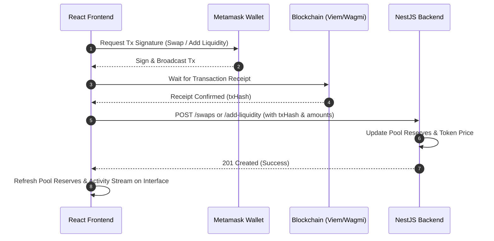

# 🌐 DEX Backend API & Integration Guide

Welcome to the backend system for the Decentralized Exchange (DEX). This service is built on **NestJS**, a progressive Node.js framework, and integrates with **MongoDB** (via Mongoose) to index blockchain events, compute OHLC chart candles, and fetch real-time market data via CoinGecko.

This guide provides a comprehensive overview of the backend capabilities, detailed database schemas, full REST API specifications, and step-by-step instructions on connecting the frontend to this backend.

---

## 🏗️ System Architecture

The following diagram illustrates how the frontend interacts with both the blockchain (for transactions) and this backend service (for analytics, charting, and transaction tracking).

```mermaid
graph TD
    subgraph Frontend [React / TypeScript Frontend]
        UI["DEX User Interface"]
        Client["Axios API Client"]
        UI --> Client
    end

    subgraph Blockchain [On-Chain Execution]
        SC["Smart Contracts (Liquidity Pools)"]
        Wallet["Web3 Wallet (MetaMask / WalletConnect)"]
        UI --> Wallet
        Wallet --> SC
    end

    subgraph Backend [NestJS Server (Port 5000)]
        API["REST Endpoints / Controller"]
        Mongoose["Mongoose ORM Service"]
        CG["CoinGecko Platform Service"]
        API --> Mongoose
        API --> CG
    end

    subgraph Database [MongoDB]
        DB[("Collections: Pools, Swaps, Tokens, Liquidity")]
        Mongoose --> DB
    end

    %% Interaction Flow
    Wallet -- "1. Submit Transaction" --> SC
    Wallet -- "2. Receive Tx Hash & Receipt" --> UI
    Client -- "3. Log Tx details to API" --> API
    CG -- "Fetch Real-time Market Stats" --> CoinGecko["CoinGecko contract API"]
```

---

## 🚀 Quick Start

### Prerequisites
- **Node.js** (v18+ recommended)
- **MongoDB** instance running locally or on MongoDB Atlas

### 1. Environment Setup
Create a `.env` file in the root directory:
```env
PORT=5000
MONGO_URI=mongodb://localhost:27017/dex-db
```

### 2. Installation & Running
```bash
# Install dependencies
npm install

# Run backend in watch/development mode
npm run start:dev

# Run unit tests
npm run test

# Run integration tests
npm run test:integration
```

> [!NOTE]
> Once started, the interactive **Swagger/OpenAPI documentation** will be available at: [http://localhost:5000/api](http://localhost:5000/api). CORS is enabled globally for all incoming origins.

---

## 🗄️ Database Schemas & Data Models

The database maintains 5 primary collections in MongoDB:

### 1. Pools
Stores information about registered liquidity pools.

| Field | Type | Description | Constraints |
| :--- | :--- | :--- | :--- |
| `poolAddress` | `String` | Unique Ethereum address of the pool | Unique, lowercase, indexed |
| `token0Address` | `String` | Contract address of Token 0 | Lowercase |
| `token1Address` | `String` | Contract address of Token 1 | Lowercase |
| `token0Symbol` | `String` | Symbol of Token 0 (e.g. `USDC`) | Required |
| `token1Symbol` | `String` | Symbol of Token 1 (e.g. `WETH`) | Required |
| `token0InitialAmount` | `String` | Initial liquidity of token0 added at pool creation | Required |
| `token1InitialAmount` | `String` | Initial liquidity of token1 added at pool creation | Required |
| `currentToken0Amount` | `String` | Current reserve of Token 0 in the pool | Required |
| `currentToken1Amount` | `String` | Current reserve of Token 1 in the pool | Required |
| `creatorWallet` | `String` | Wallet address that deployed the pool | Lowercase |
| `txHash` | `String` | Transaction hash of the deployment | Unique, lowercase |
| `chainId` | `Number` | Blockchain network ID | Required |
| `feeTier` | `Number` | Fee tier in basis points (e.g., `3000` = 0.3%) | Required |
| `protocol` | `String` | Pool protocol version (defaults to `v3`) | Required |

### 2. Swaps
Logs swap transactions performed on the exchange.

| Field | Type | Description |
| :--- | :--- | :--- |
| `walletAddress` | `String` | Ethereum address of the user performing the swap |
| `poolAddress` | `String` | Pool where the swap occurred |
| `tokenIn` | `String` | Contract address of the token sold |
| `tokenOut` | `String` | Contract address of the token bought |
| `amountIn` | `String` | Amount of token sold (in raw base units) |
| `amountOut` | `String` | Amount of token bought (in raw base units) |
| `txHash` | `String` | Blockchain transaction hash |
| `price` | `Number` | Rate of Token0 relative to Token1 for this swap |
| `chainId` | `Number` | Blockchain network ID |

### 3. Tokens
Maintains list of tokens that have been registered through created pools.

| Field | Type | Description |
| :--- | :--- | :--- |
| `tokenAddress` | `String` | Unique token address (lowercased) |
| `symbol` | `String` | Token symbol |
| `decimals` | `Number` | Number of decimal places |
| `chainId` | `Number` | Blockchain network ID |
| `firstPoolAddress`| `String` | Address of the pool where the token was first registered |
| `price` | `String` | Last recorded price from swap events |

### 4. AddLiquidity / RemoveLiquidity
Keeps history of liquidity deposits and withdrawals.

| Field | Type | Description |
| :--- | :--- | :--- |
| `poolAddress` | `String` | Pool where liquidity action takes place |
| `walletAddress` | `String` | Liquidity provider's wallet address |
| `token0Amount` | `String` | Amount of Token 0 added/removed |
| `token1Amount` | `String` | Amount of Token 1 added/removed |
| `txHash` | `String` | Transaction hash |
| `chainId` | `Number` | Network chain ID |

---

## 📡 API Reference

Below is a detailed specification of all REST endpoints available.

### Summary Table

| Module | Method | Endpoint | Description |
| :--- | :--- | :--- | :--- |
| **Pools** | `POST` | `/pools` | Register a newly created liquidity pool |
| | `GET` | `/pools` | Fetch all registered pools |
| | `GET` | `/pools/:address` | Get details of a single pool |
| **Swaps** | `POST` | `/swaps` | Record a successful swap and update reserves |
| | `GET` | `/swaps` | Fetch all swaps in chronological order |
| | `GET` | `/swaps/wallet/:address`| Get swap transactions for a specific wallet |
| **Tokens** | `GET` | `/tokens` | Get all registered tokens |
| | `GET` | `/tokens/:address` | Get details of a single registered token |
| **Chart Data**| `GET` | `/chart-data/candles` | Get time-bucketed OHLC price candles |
| **Market Data**| `GET` | `/market-data` | Get CoinGecko stats for all registered tokens |
| | `GET` | `/market-data/:tokenAddress` | Get CoinGecko stats for a single token |
| **Add Liquidity**| `POST` | `/add-liquidity` | Log a liquidity deposit & increment reserves |
| | `GET` | `/add-liquidity/:poolAddress`| Get all liquidity additions for a pool |
| **Remove Liquidity**| `POST`| `/remove-liquidity` | Log a liquidity withdrawal & decrement reserves |
| | `GET` | `/remove-liquidity/:poolAddress`| Get all liquidity removals for a pool |
| **Activity** | `GET` | `/activity/:poolAddress`| Unified stream of swaps & liquidity actions |

---

### Detailed Endpoints

#### 1. Pools

* **Register Pool (`POST /pools`)**
  * **Payload (`CreatePoolDto`):**
    ```json
    {
      "poolAddress": "0xab905aba2cf13128f1233f68800d85a275eddbcf",
      "token0Address": "0xa0b86991c6218b36c1d19d4a2e9eb0ce3606eb48",
      "token1Address": "0xc02aaa39b223fe8d0a0e5c4f27ead9083c756cc2",
      "token0Symbol": "USDC",
      "token1Symbol": "WETH",
      "creatorWallet": "0x742d35cc6634c0532925a3b844bc99e4d8141f3e",
      "txHash": "0x1234567890abcdef1234567890abcdef1234567890abcdef1234567890abcdef",
      "chainId": 1,
      "feeTier": 3000,
      "token0Decimals": 6,
      "token1Decimals": 18,
      "token0InitialAmount": "1000000",
      "token1InitialAmount": "1000"
    }
    ```
  * **Response (201):**
    ```json
    {
      "success": true,
      "message": "Pool created successfully",
      "data": {
        "poolAddress": "0xab905aba2cf13128f1233f68800d85a275eddbcf",
        "token0Address": "0xa0b86991c6218b36c1d19d4a2e9eb0ce3606eb48",
        "token1Address": "0xc02aaa39b223fe8d0a0e5c4f27ead9083c756cc2",
        "token0Symbol": "USDC",
        "token1Symbol": "WETH",
        "token0InitialAmount": "1000000",
        "token1InitialAmount": "1000",
        "currentToken0Amount": "1000000",
        "currentToken1Amount": "1000",
        "creatorWallet": "0x742d35cc6634c0532925a3b844bc99e4d8141f3e",
        "txHash": "0x1234567890abcdef1234567890abcdef1234567890abcdef1234567890abcdef",
        "chainId": 1,
        "feeTier": 3000,
        "protocol": "v3",
        "_id": "647f12cfa8a9018bb9324672",
        "createdAt": "2026-06-08T10:00:00.000Z",
        "updatedAt": "2026-06-08T10:00:00.000Z"
      }
    }
    ```

* **Get Pool Details (`GET /pools/:address`)**
  * **Response (200):** Returns the pool details (same structure as `data` above). Returns `404` if not found.

---

#### 2. Swaps

* **Record Swap (`POST /swaps`)**
  * **Payload (`CreateSwapDto`):**
    ```json
    {
      "walletAddress": "0x742d35cc6634c0532925a3b844bc99e4d8141f3e",
      "poolAddress": "0xab905aba2cf13128f1233f68800d85a275eddbcf",
      "tokenIn": "0xa0b86991c6218b36c1d19d4a2e9eb0ce3606eb48",
      "tokenOut": "0xc02aaa39b223fe8d0a0e5c4f27ead9083c756cc2",
      "amountIn": "100000",
      "amountOut": "50",
      "txHash": "0x9876543210abcdef9876543210abcdef9876543210abcdef9876543210abcdef",
      "chainId": 1,
      "price": 0.0005
    }
    ```
  * **Response (201):**
    ```json
    {
      "walletAddress": "0x742d35cc6634c0532925a3b844bc99e4d8141f3e",
      "poolAddress": "0xab905aba2cf13128f1233f68800d85a275eddbcf",
      "tokenIn": "0xa0b86991c6218b36c1d19d4a2e9eb0ce3606eb48",
      "tokenOut": "0xc02aaa39b223fe8d0a0e5c4f27ead9083c756cc2",
      "amountIn": "100000",
      "amountOut": "50",
      "txHash": "0x9876543210abcdef9876543210abcdef9876543210abcdef9876543210abcdef",
      "chainId": 1,
      "price": 0.0005,
      "_id": "647f12e8a8a9018bb9324675",
      "createdAt": "2026-06-08T10:05:00.000Z",
      "updatedAt": "2026-06-08T10:05:00.000Z"
    }
    ```

> [!IMPORTANT]
> When a swap is posted:
> 1. If `tokenIn` matches `token0Address`, the pool reserves for `token0` increase by `amountIn`, and reserves for `token1` decrease by `amountOut`.
> 2. If `tokenIn` matches `token1Address`, the reverse occurs.
> 3. The price of `token0` in the database is automatically updated to the current swap price.

---

#### 3. Chart Data (OHLC Candles)

* **Get Candles (`GET /chart-data/candles?poolAddress=...&timeframe=...`)**
  * **Query Parameters:**
    * `poolAddress` (Required): Address of the liquidity pool.
    * `timeframe` (Required): The time interval. Supported: `1m`, `5m`, `15m`, `30m`, `1h`, `4h`, `1d`.
  * **Response (200):**
    ```json
    [
      {
        "time": 1772884800,
        "open": 0.0005,
        "high": 0.00052,
        "low": 0.00049,
        "close": 0.00051,
        "volume": 50000
      }
    ]
    ```

> [!TIP]
> The candle builder provides **continuous charts**. If a timeframe has no swaps, the system carries forward the previous close price as the open/high/low/close with a volume of 0 to ensure smooth graphing in charting libraries (e.g. lightweight-charts).

---

#### 4. Market Data (CoinGecko Integration)

* **Get Token Market Details (`GET /market-data/:tokenAddress`)**
  * Fetches real-time price feed and token stats directly from CoinGecko based on contract address and Chain ID.
  * **Supported Chain IDs:**
    * `1`: Ethereum
    * `56`: Binance Smart Chain
    * `137`: Polygon
    * `42161`: Arbitrum One
    * `8453`: Base
  * **Response (200):**
    ```json
    {
      "tokenAddress": "0xa0b86991c6218b36c1d19d4a2e9eb0ce3606eb48",
      "symbol": "USDC",
      "chainId": 1,
      "price": 1.0002,
      "change24h": 0.02,
      "fdv": 27356281900,
      "volume24h": 482719280,
      "marketCap": 27356281900,
      "image": "https://assets.coingecko.com/coins/images/6319/large/USD_Coin_icon.png"
    }
    ```

---

#### 5. Liquidity Logs

* **Log Liquidity Addition (`POST /add-liquidity`)**
  * **Payload (`CreateAddLiquidityDto`):**
    ```json
    {
      "poolAddress": "0xab905aba2cf13128f1233f68800d85a275eddbcf",
      "token0Amount": "500000",
      "token1Amount": "500",
      "walletAddress": "0x742d35cc6634c0532925a3b844bc99e4d8141f3e",
      "txHash": "0xabcdef1234567890abcdef1234567890abcdef1234567890abcdef1234567890",
      "chainId": 1
    }
    ```
  * **Side Effect:** Automatically increments `currentToken0Amount` and `currentToken1Amount` in the pool schema by the amounts supplied.

* **Log Liquidity Removal (`POST /remove-liquidity`)**
  * **Payload (`CreateRemoveLiquidityDto`):** (Same schema as Add Liquidity DTO)
  * **Side Effect:** Automatically decrements pool reserves by the specified amounts.

---

#### 6. Pool Activity Feed

* **Get Activity Stream (`GET /activity/:poolAddress`)**
  * Combines all swap records, additions of liquidity, and removals of liquidity for a specific pool, sorted in descending chronological order (newest first).
  * **Response (200):**
    ```json
    [
      {
        "type": "swap",
        "_id": "647f12e8a8a9018bb9324675",
        "walletAddress": "0x742d35cc6634c0532925a3b844bc99e4d8141f3e",
        "poolAddress": "0xab905aba2cf13128f1233f68800d85a275eddbcf",
        "tokenIn": "0xa0b86991c6218b36c1d19d4a2e9eb0ce3606eb48",
        "tokenOut": "0xc02aaa39b223fe8d0a0e5c4f27ead9083c756cc2",
        "amountIn": "100000",
        "amountOut": "50",
        "txHash": "0x9876543210abcdef9876543210abcdef9876543210abcdef9876543210abcdef",
        "price": 0.0005,
        "createdAt": "2026-06-08T10:05:00.000Z"
      },
      {
        "type": "add-liquidity",
        "_id": "647f12f0a8a9018bb9324679",
        "poolAddress": "0xab905aba2cf13128f1233f68800d85a275eddbcf",
        "walletAddress": "0x742d35cc6634c0532925a3b844bc99e4d8141f3e",
        "token0Amount": "500000",
        "token1Amount": "500",
        "txHash": "0xabcdef1234567890abcdef1234567890abcdef1234567890abcdef1234567890",
        "createdAt": "2026-06-08T10:01:00.000Z"
      }
    ]
    ```

---

## 🔌 Frontend Integration Guide

This step-by-step section demonstrates how to implement Web3 calls and coordinate updates with the NestJS API.

### Flow of Coordination
To maintain consistency between the blockchain state and MongoDB:
1. User requests a transaction (e.g. Swap) on the frontend.
2. Frontend submits transaction to the blockchain using **Ethers**, **Viem**, or **Wagmi** and prompts user approval in their wallet.
3. Wait for the transaction to be **mined** (transaction receipt becomes available).
4. Send a `POST` request with the transaction details, hash, and pricing to the NestJS API.
5. The API writes to the database, updates pool reserves, caches token price info, and the UI updates dynamically with the new state.



---

### Step 1: Create the API Client

Create a file named `src/services/api.ts` on your frontend:

```typescript
import axios from 'axios';

const API_BASE_URL = 'http://localhost:5000'; // Replace with production URL if deployed

export const dexApi = axios.create({
  baseURL: API_BASE_URL,
  headers: {
    'Content-Type': 'application/json',
  },
});

// Interfaces matching backend DTOs
export interface CreatePoolDto {
  poolAddress: string;
  token0Address: string;
  token1Address: string;
  token0Symbol: string;
  token1Symbol: string;
  creatorWallet: string;
  txHash: string;
  chainId: number;
  feeTier: number;
  token0Decimals: number;
  token1Decimals: number;
  token0InitialAmount: string;
  token1InitialAmount: string;
}

export interface CreateSwapDto {
  walletAddress: string;
  poolAddress: string;
  tokenIn: string;
  tokenOut: string;
  amountIn: string;
  amountOut: string;
  txHash: string;
  chainId: number;
  price: number;
}

export interface CreateLiquidityDto {
  poolAddress: string;
  token0Amount: string;
  token1Amount: string;
  walletAddress: string;
  txHash: string;
  chainId: number;
}

// Client functions
export const dexClient = {
  // Pools
  createPool: async (data: CreatePoolDto) => {
    const res = await dexApi.post('/pools', data);
    return res.data;
  },
  getPools: async () => {
    const res = await dexApi.get('/pools');
    return res.data;
  },
  getPoolByAddress: async (address: string) => {
    const res = await dexApi.get(`/pools/${address}`);
    return res.data;
  },

  // Swaps
  recordSwap: async (data: CreateSwapDto) => {
    const res = await dexApi.post('/swaps', data);
    return res.data;
  },
  getSwapsByWallet: async (walletAddress: string) => {
    const res = await dexApi.get(`/swaps/wallet/${walletAddress}`);
    return res.data;
  },

  // Candles
  getCandles: async (poolAddress: string, timeframe: string) => {
    const res = await dexApi.get('/chart-data/candles', {
      params: { poolAddress, timeframe },
    });
    return res.data;
  },

  // Market Data
  getMarketData: async () => {
    const res = await dexApi.get('/market-data');
    return res.data;
  },
  getTokenMarketData: async (tokenAddress: string) => {
    const res = await dexApi.get(`/market-data/${tokenAddress}`);
    return res.data;
  },

  // Liquidity Operations
  recordAddLiquidity: async (data: CreateLiquidityDto) => {
    const res = await dexApi.post('/add-liquidity', data);
    return res.data;
  },
  recordRemoveLiquidity: async (data: CreateLiquidityDto) => {
    const res = await dexApi.post('/remove-liquidity', data);
    return res.data;
  },

  // Activity Feed
  getPoolActivity: async (poolAddress: string) => {
    const res = await dexApi.get(`/activity/${poolAddress}`);
    return res.data;
  },
};
```

---

### Step 2: Implement Swap Page Coordination

Here is a simplified example of how you can hook up your transaction state (using standard wagmi/viem style) and trigger backend database indexing.

```tsx
import React, { useState } from 'react';
import { useWriteContract, useWaitForTransactionReceipt, useAccount } from 'wagmi';
import { parseUnits, formatUnits } from 'viem';
import { dexClient } from '../services/api';

// Swap pool addresses & mock ABI
const SWAP_ROUTER_ADDRESS = '0xYourSwapRouterContractAddress';
const ROUTER_ABI = [/* ... SwapRouter contract ABI ... */] as const;

export function SwapComponent({ pool }: { pool: any }) {
  const { address: walletAddress, chainId } = useAccount();
  const [tokenInAmount, setTokenInAmount] = useState('');
  const [tokenOutAmount, setTokenOutAmount] = useState('');
  const [isSubmittingToBackend, setIsSubmittingToBackend] = useState(false);

  const { writeContractAsync, data: hash } = useWriteContract();

  // Watch for contract transaction resolution
  const { data: receipt, isSuccess } = useWaitForTransactionReceipt({ hash });

  const executeSwap = async () => {
    if (!walletAddress || !chainId) return alert('Please connect wallet');

    try {
      // 1. Submit execution call to smart contracts via wallet
      const txHash = await writeContractAsync({
        address: SWAP_ROUTER_ADDRESS,
        abi: ROUTER_ABI,
        functionName: 'exactInputSingle',
        args: [
          /* router arguments: tokenIn, tokenOut, fee, recipient, deadline, amountIn, amountOutMinimum, sqrtPriceLimitX96 */
        ],
      });

      console.log('Contract transaction submitted: ', txHash);

      // 2. Wait for confirmation receipt
      setIsSubmittingToBackend(true);
      
      // Usually, inside useWaitForTransactionReceipt hook, isSuccess changes to true.
      // Alternatively, execute sequentially:
    } catch (err) {
      console.error('Blockchain transaction failed', err);
    }
  };

  // 3. Listen for transaction confirmation and report to NestJS
  React.useEffect(() => {
    const reportTxToBackend = async () => {
      if (isSuccess && receipt && hash) {
        try {
          const swapPrice = Number(tokenInAmount) > 0 
            ? Number(tokenOutAmount) / Number(tokenInAmount) 
            : 0;

          await dexClient.recordSwap({
            walletAddress: walletAddress!,
            poolAddress: pool.poolAddress,
            tokenIn: pool.token0Address, // or token1 depending on user's direction
            tokenOut: pool.token1Address,
            amountIn: parseUnits(tokenInAmount, pool.token0Decimals).toString(),
            amountOut: parseUnits(tokenOutAmount, pool.token1Decimals).toString(),
            txHash: hash,
            chainId: chainId!,
            price: swapPrice,
          });

          alert('Swap complete and logged to backend database!');
        } catch (error) {
          console.error('Error logging swap to backend', error);
        } finally {
          setIsSubmittingToBackend(false);
        }
      }
    };
    reportTxToBackend();
  }, [isSuccess, receipt, hash]);

  return (
    <div className="swap-card">
      <input 
        value={tokenInAmount} 
        onChange={(e) => setTokenInAmount(e.target.value)} 
        placeholder="0.0" 
      />
      <button onClick={executeSwap} disabled={isSubmittingToBackend}>
        {isSubmittingToBackend ? 'Syncing with Backend...' : 'Swap Tokens'}
      </button>
    </div>
  );
}
```

---

### Step 3: Implement TradingView Lightweight Charts

The candle data from `GET /chart-data/candles` matches the format required by the lightweight-charts library.

```tsx
import React, { useEffect, useRef } from 'react';
import { createChart } from 'lightweight-charts';
import { dexClient } from '../services/api';

export function CandlestickChart({ poolAddress, timeframe }: { poolAddress: string; timeframe: string }) {
  const chartContainerRef = useRef<HTMLDivElement>(null);

  useEffect(() => {
    if (!chartContainerRef.current) return;

    // 1. Initialize Lightweight Chart
    const chart = createChart(chartContainerRef.current, {
      width: chartContainerRef.current.clientWidth,
      height: 400,
      layout: {
        background: { color: '#0d0e12' },
        textColor: '#d1d4dc',
      },
      grid: {
        vertLines: { color: '#2b2b36' },
        horzLines: { color: '#2b2b36' },
      },
    });

    const candleSeries = chart.addCandlestickSeries({
      upColor: '#26a69a',
      downColor: '#ef5350',
      borderVisible: false,
      wickUpColor: '#26a69a',
      wickDownColor: '#ef5350',
    });

    // 2. Fetch candle data from API
    dexClient.getCandles(poolAddress, timeframe)
      .then((data) => {
        // Map backend candle time to TradingView's UTCTimestamp format
        const formattedData = data.map((candle: any) => ({
          time: candle.time,
          open: candle.open,
          high: candle.high,
          low: candle.low,
          close: candle.close,
        }));
        
        candleSeries.setData(formattedData);
      })
      .catch((err) => console.error('Error fetching chart data', err));

    // Cleanup
    return () => {
      chart.remove();
    };
  }, [poolAddress, timeframe]);

  return <div ref={chartContainerRef} style={{ width: '100%', height: '400px' }} />;
}
```

---

## 🛠️ Diagnostics & Maintenance
Use the NestJS command line or API logs to diagnose sync issues:
* **Duplicate Errors:** Swaps and Pools enforce unique hashes; trying to log the same transaction twice returns a `400 Bad Request`.
* **Database Reset:** In case of testnet/local resets, purge MongoDB databases by running `db.dropDatabase()` inside the Mongo Shell.
# dex-explore

