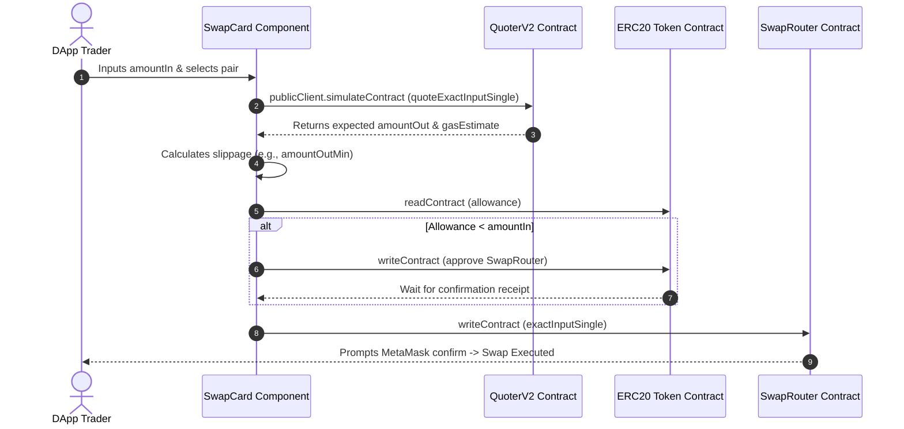

# 🌐 MSTSwap V3 — Full-Suite Integration & Systems Wiring Playbook

This playbook serves as the primary system-wiring specification for both the **Frontend** and **Backend** engineering teams. It maps a high-performance, responsive consumer DApp (including Landing Page, Swap Dashboard, Live Trending Charts, Recipient Transfer Calculator, and Wallet Explorer) directly to the **MST Blockchain (MST Testnet, Chain ID: `91562037`)** using the deployed Uniswap V3 core/periphery smart contracts.

---

## 🏛️ End-to-End Systems Architecture & Wiring Diagram

The following blueprint details how the React frontend, the Express API backend, the WebSocket price server, the Subgraph, and the MST EVM blockchain wire together.

```mermaid
graph TB
    %% Client Tier
    subgraph Client [Client DApp Tier]
        Wallet[MetaMask / Injected Wallet <br> Connected to MST Testnet]
        FE_Landing[1. Landing Page <br> Features, Stats, About, Contact]
        FE_Dashboard[2. Swap Dashboard <br> Quoting, Swapping, Pools]
        FE_Calculator[3. Transfer Calculator <br> Live Fee Estimation]
        FE_Explorer[4. Wallet Explorer <br> Address Balance & Tx History]
    end

    %% Backend Tier
    subgraph BackendSystem [Backend Service Tier]
        BE_API[Express REST API <br> :3001]
        BE_WS[WebSocket Price Tick Server <br> ws:///ws/prices]
        BE_Listener[Viem WS Event Listener]
        Redis[(Redis Pub/Sub Cache)]
        DB[(Prisma Database)]
    end

    %% Indexing Tier
    subgraph Indexer [Indexing Tier]
        SubGraph[The Graph / Subgraph Indexer]
    end

    %% Blockchain Tier
    subgraph Blockchain [MST Blockchain Layer]
        Factory[UniswapV3Factory <br> 0xac925e...0cde]
        NPM[NonfungiblePositionManager <br> 0x487e0e...87de]
        Router[SwapRouter <br> 0xefa026...35f6]
        Quoter[QuoterV2 <br> 0x9b65cc...c86a]
        Pool[WMST/USDC LP Pool <br> 0x884E95...5f15]
        Tokens[ERC20 Assets <br> WMST, USDC, USDT, WBTC]
        LPStorage[LPStateStorage <br> 0x7aEbeF...c183]
    end

    %% Client and Contract Connections
    Wallet <-->|RPC Provider| Client
    Client -->|API Requests| BE_API
    FE_Dashboard <-->|Real-time Swaps| BE_WS
    FE_Dashboard -->|Stateless Quote Simulation| Quoter
    FE_Dashboard -->|Write swap transactions| Router
    FE_Dashboard -->|Mint/Adjust LP Positions| NPM
    FE_Calculator -->|Estimate gas Limit & Price| Blockchain
    FE_Explorer -->|Read ERC-20 balances| Tokens

    %% Backend Sync Loops
    BE_Listener -->|Subscribe to Swap events| Pool
    BE_Listener -->|Publish prices| Redis
    Redis -->|Subscribe| BE_WS
    BE_WS -->|Fanout price ticks| FE_Dashboard
    SubGraph -->|Track PoolCreated events| Factory
    SubGraph -->|Index swaps & positions| Pool
    SubGraph -.->|GraphQL Sync| DB
    DB <-->|Read/Write stats| BE_API
```



---

## 📂 Production Component-to-Contract Directory

To match the product interface, configure components to execute specific read/write actions on the MST blockchain:

| DApp Page / Feature | Component Name | MST Smart Contract / API Dependency | Interaction Type |
| :--- | :--- | :--- | :--- |
| **Landing Page** | `Header`, `Hero`, `Stats` | **UniswapV3Factory** & `/api/pools` | **Read**: Query total volume, pool metrics, and active pool listings. |
| **Landing Page (Contact)**| `ContactForm` | **Formspree API Key** (`.env`) | **Write**: Submits messages to your email endpoint via React. |
| **Swap Dashboard** | `SwapCard` | **QuoterV2** & **SwapRouter** | **Read**: stateless simulation for `amountOut`. <br>**Write**: ERC20 token approvals & swap execution. |
| **Swap Dashboard** | `TokenSelector` | `/api/tokens` | **Read**: Populates token search dropdown lists. |
| **Trending Pools** | `MarketMatrix`, `MarketChart`| **LPStateStorage** & `/api/pools` | **Read**: Renders dynamic charts for active trading pools. |
| **Transfer Calculator** | `TokenTransfer` | **EVM Public Client** (RPC provider) | **Read**: Fetches real-time balance, estimates exact transaction gas fee before sending. |
| **Wallet Explorer** | `WalletDashboard`, `WalletSearch`| **ERC20 Tokens** & **Subgraph GraphQL** | **Read**: Queries multi-token balances and transaction histories. |

---

## 🎨 Page-by-Page Integration Guide (Frontend)

### 1. The Global MST Network Config
The entire DApp requires MetaMask to be connected to the **MST Testnet**.
*   **Chain Parameters** (`frontend/src/config/chains.ts`):
    ```typescript
    export const mstChain = {
      id: 91562037,
      name: "MST Testnet",
      nativeCurrency: { name: "MST", symbol: "MST", decimals: 18 },
      rpcUrls: {
        default: { http: ["https://testnetrpc.mstblockchain.com"] }
      },
      blockExplorers: {
        default: { name: "MSTScan", url: "https://testnet.mstscan.com" }
      }
    } as const;
    ```

### 2. The Swap Dashboard (`SwapCard.tsx`)
The user selects an input token, enters the quantity, views estimated fees, and submits the trade:



#### Step A: Simulating the Exchange Quote (QuoterV2)
```typescript
import { CONTRACTS, quoterV2Abi, V3_FEE, ZERO_SQRT_PRICE_LIMIT } from "../../config/contracts";

const { result } = await publicClient.simulateContract({
  address: CONTRACTS.quoterV2,
  abi: quoterV2Abi,
  functionName: "quoteExactInputSingle",
  args: [
    {
      tokenIn: inputTokenAddress,
      tokenOut: outputTokenAddress,
      amountIn: amountInRaw,
      fee: V3_FEE, // 3000 (0.3%)
      sqrtPriceLimitX96: ZERO_SQRT_PRICE_LIMIT
    }
  ]
});
const amountOut = result[0];
const estimatedGas = result[3];
```

#### Step B: Wrapping Native MST & Checking approvals
```typescript
// 1. If using native token, wrap it first in a separate transaction
if (inputTokenIsNativeWrapped) {
  const wrapTx = await writeContractAsync({
    address: CONTRACTS.wmst,
    abi: [{
      type: "function",
      name: "deposit",
      stateMutability: "payable",
      inputs: [],
      outputs: []
    }] as const,
    functionName: "deposit",
    args: [],
    value: amountInRaw
  });
  await publicClient.waitForTransactionReceipt({ hash: wrapTx });
}

// 2. Check and submit ERC-20 approvals for the SwapRouter
const allowance = await publicClient.readContract({
  address: inputTokenAddress,
  abi: erc20Abi,
  functionName: "allowance",
  args: [userAddress, CONTRACTS.swapRouter]
});

if (allowance < amountInRaw) {
  const approveTx = await writeContractAsync({
    address: inputTokenAddress,
    abi: erc20Abi,
    functionName: "approve",
    args: [CONTRACTS.swapRouter, amountInRaw]
  });
  await publicClient.waitForTransactionReceipt({ hash: approveTx });
}
```

#### Step C: Executing the On-chain Swap (SwapRouter)
```typescript
const amountOutMinimum = (amountOut * BigInt(10000 - slippageBps)) / 10000n;
const deadline = BigInt(Math.floor(Date.now() / 1000) + 1200); // 20 mins

const txHash = await writeContractAsync({
  address: CONTRACTS.swapRouter,
  abi: swapRouterAbi,
  functionName: "exactInputSingle",
  args: [
    {
      tokenIn: inputTokenAddress,
      tokenOut: outputTokenAddress,
      fee: V3_FEE,
      recipient: userAddress,
      deadline,
      amountIn: amountInRaw,
      amountOutMinimum,
      sqrtPriceLimitX96: ZERO_SQRT_PRICE_LIMIT
    }
  ],
  value: 0n // Value is always 0n because we wrap MST separately beforehand
});
```

### 3. The Transfer Fee Calculator (`TokenTransfer.tsx`)
This page lets users input a recipient address and quantity to send, displaying the live network commission fee in native MST:
*   **Gas Estimation Method**:
    ```typescript
    // 1. Estimate gas limit for the transfer
    const gasLimit = await publicClient.estimateGas({
      account: userAddress,
      to: recipientAddress,
      value: transferAmountRaw
    });

    // 2. Fetch current gas price on the MST Blockchain
    const gasPrice = await publicClient.getGasPrice();

    // 3. Compute live transaction fee (EIP-1559 base + tip)
    const transactionFeeRaw = gasLimit * gasPrice;
    const transactionFeeMST = formatUnits(transactionFeeRaw, 18);
    ```

### 4. The Wallet Explorer (`WalletSearch.tsx` & `WalletDashboard.tsx`)
Users search any address on the MST Blockchain to index all balances and historical contract transactions.

#### Step A: Reading Multi-Token Balances
```typescript
const tokensList = [
  { symbol: "WMST", address: CONTRACTS.wmst },
  { symbol: "USDC", address: "0x3468b4ac95f03534a15F633790d9BbD88b130170" },
  { symbol: "USDT", address: "0x..." }
];

const balances = await Promise.all(
  tokensList.map(async (token) => {
    const rawBalance = await publicClient.readContract({
      address: token.address,
      abi: erc20Abi,
      functionName: "balanceOf",
      args: [searchedAddress]
    });
    return { symbol: token.symbol, balance: formatUnits(rawBalance, token.decimals) };
  })
);
```

#### Step B: Querying Transaction Histories
We fetch transactions from the custom Subgraph indexing matching swaps:
```graphql
query GetUserTransactions($userAddress: Bytes!) {
  swaps(where: { sender: $userAddress }, orderBy: timestamp, orderDirection: desc) {
    id
    amount0
    amount1
    timestamp
    pool {
      token0
      token1
    }
  }
}
```
*   *UI Tip*: Generate anchor links to the verified Explorer: `https://testnet.mstscan.com/tx/${txHash}`.

### 5. Contact Form Integration (`ContactForm.tsx`)
Uses Formspree integration for secure email dispatching:
*   **Env Configuration**: Set `FORM_ID` in `.env`.
*   **Submission Action**:
    ```typescript
    const handleSubmit = async (e: React.FormEvent) => {
      e.preventDefault();
      await fetch("https://formspree.io/f/" + import.meta.env.VITE_FORM_ID, {
        method: "POST",
        headers: { "Content-Type": "application/json" },
        body: JSON.stringify({ name, email, subject, category, message })
      });
    };
    ```

---

## ⚙️ REST APIs & WebSocket Pricing Engines (Backend)

The Express backend manages smart routing, pool metrics, and stream events.

### 1. Smart Order Router (`Sor.ts`)
Calculates the optimal routing path across the pool graph for a trade request:
*   **Endpoint**: `POST /api/quote`
*   **Dijkstra Hop Math**:
    ```typescript
    // In-memory pool configuration matching active MST Blockchain pairs
    const POOL_GRAPH = {
      WMST: [{ to: "USDC", reserveIn: 1000000, reserveOut: 2000000 }],
      USDC: [{ to: "WMST", reserveIn: 2000000, reserveOut: 1000000 }]
    };
    ```

### 2. WebSocket Real-time Pricing (`listener.ts` & `server.ts`)
Listens to MST on-chain block events via Viem WebSockets and publishes price updates to Redis for the frontend charts:
```typescript
// Subscribes to Pool Swap Events
const SWAP_EVENT = parseAbiItem(
  "event Swap(address indexed sender, address indexed recipient, int256 amount0, int256 amount1, uint160 sqrtPriceX96, uint128 liquidity, int24 tick)"
);

client.watchEvent({
  event: SWAP_EVENT,
  onLogs: async (logs) => {
    for (const log of logs) {
      await redis.publish("prices", JSON.stringify({
        type: "swap",
        txHash: String(log.transactionHash),
        blockNumber: String(log.blockNumber)
      }));
    }
  }
});
```

---

## 🚀 Step-by-Step Production Deployment Playbook (Hostinger)

Deploy the static build to production hosting (such as Hostinger):

### Step 1: Generate the Build Assets
1. Open terminal inside `frontend` workspace.
2. Compile and package:
   ```bash
   npm run build
   ```
3. This creates a standard `dist` or `out` folder containing all compressed HTML, Tailwind-compiled CSS, React code, and assets.

### Step 2: Configure Hosting & Domain
1. Log in to your Hostinger Account Dashboard.
2. Go to **Domains** -> Register or Setup your custom domain (e.g. `coders-projects.store`).
3. Set your Country and Register details to make the URL active.
4. Set up the DNS nameservers to point to Hostinger's standard servers.

### Step 3: Initialize the Project Space
1. Go to **Websites** -> **Create or Migrate a Website**.
2. Select **Other / HTML Website** and connect it to your registered domain.
3. Set the server region closest to your audience (e.g., India or Europe).

### Step 4: Upload Static Files
1. In the Hostinger panel, navigate to **Files** -> **File Manager** -> **Access files of [your domain]**.
2. Open the `public_html` root folder.
3. Delete the default `default.html` placeholder file.
4. Drag and drop the compiled files from your local `out`/`dist` directory straight into `public_html`.
5. Once uploaded, visit your domain URL. The application will be live, fully responsive, and connected to the **MST Blockchain**!
